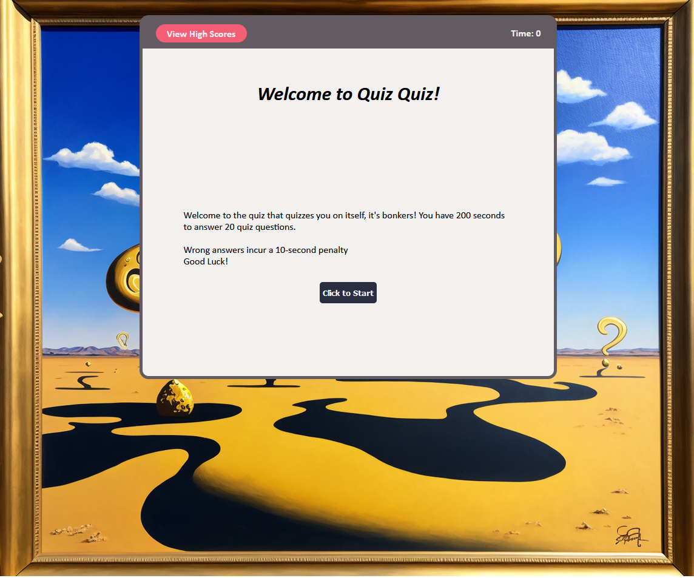

# class-quiz

## Description

This is a class assignment that required us to make a timed quiz that stores high scores in localStorage.  It has the following acceptance criteria:

-WHEN I click the start button, THEN a timer starts and I am presented with a question
-WHEN I answer a question, THEN I am presented with another question
-WHEN I answer a question incorrectly, THEN time is subtracted from the clock
-WHEN all questions are answered or the timer reaches 0, THEN the game is over
-WHEN the game is over, THEN I can save my initials and score

## Edge Cases Tested

-New user visits page for the first time
-User plays the game, then actively deletes localStorage var, starting a new game before reloading or visiting again

## Table of Contents

- [Installation](#installation)
- [Usage](#usage)
- [Credits](#credits)
- [License](#license)

## Installation

Runs in the browser for mobile, tablet, laptop, and PC devices.

## Usage

You can visit the live application at - https://maximusdecimalusmeridius.github.io/class-quiz.

## Credits

N/A

## License

MIT License - Please refer to the LICENSE in the repo.